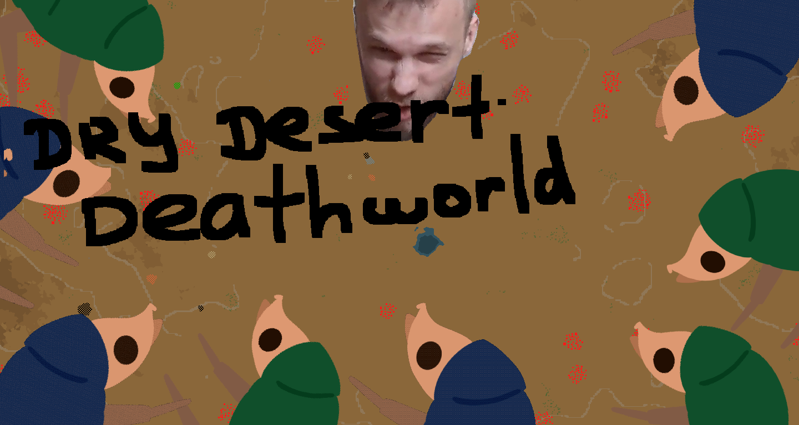

# Factorio Dry Desert Deathworld Challenge



## Rules

- Deathworld preset
- Desert (min bias for moisture/terrain type, disable water, min trees & rocks)
- Min resources - all sliders down to 17%
- Only gun turrets, artillery, rocket turrets. No flamethrowers, no laser turrest, no landmines. Personal weapons are all allowed
- Space - 400% asteroids, no asteroid collecting (except for minimum to unlock Vulcanus & Fulgora)
- Vulcanus - no lava
- Fulgora - min island coverage, max cliffs, no recycling except for scrap
- Gleba - 600% enemy nest freq & size, 1000% spoling rate
- Aquilo - ???

## Map exchange string

```factorio
>>>eNp1VL1rFEEUn0k88nnmlFMQQoyQSrgQooIEuR1tRET/hXVub+4yuLdzzsdptPDAFBaCjY022qpgpYVdwEZBQbSyi6axsDAYxUI4Z3Zu9uY2+uC9fft+7+s3s+wIAOCUVjBbwlcUjVkYcVUnIaPx0ydHq07HIhxHVBI/tidieChpMmLtNuEVxofyJtKOlVzHSZKQ1lqlhgXR05HVblBsxIpxmpCwQxLpFxQbKm4yjsMopo0GABvIajeYcQgVMU7qwsRMhXlONWNSy2q6gdOSjadLhHaJQcNpC7Z1Nyn8qn43IVkyRLEfv4ol4X7+OOUsyZ9HMaZylapWWDM8fWQ6wapDxe5tC5xFl4d4FUTEcdsvPigk5pImzRBzgsMWo0IqTmwLI6Yov3hZqLihOI1CHNF62CRrgnA/oSA5IUOTp6VKmkKSJMzxmlIcJ5rXLr4dFUc4UZpX7oPZnyEdZhwqWkOsvfO0BAD8sk8/1+dS7d0E872eUe1t6gSjAHb1p6QroA72ZaQUsURyFq9gdW2lRrGYqCwtnlgycsBB7sByuKmfP631TLYahPBG+dnZz9fvBdAOWER9Z7Mf2ai5yDnnXET/hRacc9zrcyyVH55jh0o9op81jgaOBdcNCOH26tbtF793qvDP4+0PF2qXAti5Vdz5eeR5VYNj5pBGMvPgvpGXjgrwVrDQpwC+e2vkWwALpqJsDDqpzcb5UQBLe7X36I4287PArVZ1bcoINlL55ZhsOedjkOehD8L8jOCcMa+NSQdmm0HrorsIosMOPTRI0fXLwN+hPmD4xo195c3PLbL7InweucgC+sc1TJqB9cx8Hc220ef5fsy9oYcIjhrHZO3omH3r/wnTVvZZQulxOxSA70F2Yb1UZizLylZr+S8FSn70<<<
```
